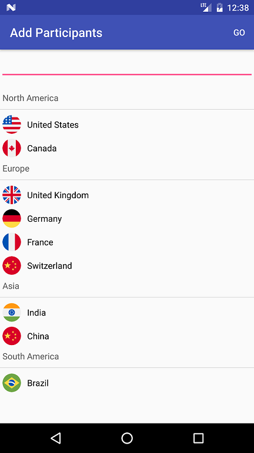
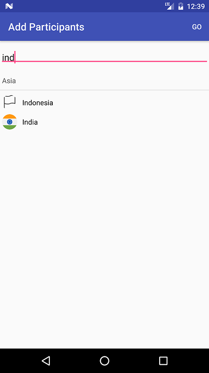

# favour
An Android library with sticky or favorited pickers that show-up by default, and auto-hide to show filtered results when users search.

Android AutoCompleteTextViews and MultiAutoCompleteTextViews are counter-initiative in such they force user to scroll through the full list or search by filtered text (i.e autocomplete search) to find what they are looking for. [Favour](https://github.com/jaladankisuresh/favour) library tries to overcome this limitation by offering popular items as a sticky list thats shows-up by default making selections quick and easy (most of the times). Nevertheless, Users could still search by filtering text.

> Popular Items, Sticky Items, Most Used Items, Hot Items or anything else? **Favour** is for you

Note: To test this library end-to-end, you may use Server WebAPI [favour-node](https://github.com/jaladankisuresh/favour-node) which is buit using Node.js and Express.

fig A: Favourite List that is visible by default  
  

fig B: Filtered List with matching search results for the search string  
  

# Usage
In your Activity or Fragment

1. Create an Intent for AddParticipantsActivity Activity (Activity class inside the Favour library)  
2. To this intent pass absolute HTTP GET urls to GET_POPULAR_ITEMS and FIND_ITEMS WebApi  
    ```java
    private final String  popularCountriesRequestUrl = "http://[[YOUR_SERVER]]/api/popular-countries";
    private final String findCountriesRequestUrl = "http://[[YOUR_SERVER]]/api/countries-search";

    Intent AddPlayersIntent = new Intent(StartActivity.this, AddParticipantsActivity.class);
    AddPlayersIntent.putExtra("getPopularCountries", popularCountriesRequestUrl);
    AddPlayersIntent.putExtra("findCountries", findCountriesRequestUrl);
    ```  
3. To this intent pass **Type** of the object to be de-serialized (or in other words response object to Http Get requests)  
    ```java
    final Type continentGroupArrayType = new TypeToken<List<ContinentGroup>>(){}.getType();

    AddPlayersIntent.putExtra("selectableGroupArrayType", (Serializable) continentGroupArrayType);
    ```  
4. Catch the selected the list of items overriding onActivityResult(). And, Use them in your application  
    ```java
    List<Country> selectedCountries = (List<Country>) data.getSerializableExtra("result_invitees");
    ```  
Final Code as in the example app
```java
public class StartActivity extends AppCompatActivity {

    private TextView lbl_show_selected_profiles;

    private final String  popularCountriesRequestUrl = "http://[[YOUR_SERVER]]/api/popular-countries";
    private final String findCountriesRequestUrl = "http://[[YOUR_SERVER]]/api/countries-search";

    @Override
    protected void onCreate(Bundle savedInstanceState) {
        super.onCreate(savedInstanceState);
        setContentView(R.layout.activity_start);

        final Type continentGroupArrayType = new TypeToken<List<ContinentGroup>>(){}.getType();
        lbl_show_selected_profiles = (TextView) findViewById(R.id.lbl_show_selected_profiles);
        Button btn_select_profiles = (Button) findViewById(R.id.btn_select_profiles);
        btn_select_profiles.setOnClickListener(new View.OnClickListener() {
            @Override
            public void onClick(View view) {
                Intent AddPlayersIntent = new Intent(StartActivity.this, AddParticipantsActivity.class);
                AddPlayersIntent.putExtra("getPopularCountries", popularCountriesRequestUrl);
                AddPlayersIntent.putExtra("findCountries", findCountriesRequestUrl);
                AddPlayersIntent.putExtra("selectableGroupArrayType", (Serializable) continentGroupArrayType);
                startActivityForResult(AddPlayersIntent, convertTo16Bit(view.getId()));
            }
        });
    }

    @Override
    public void onActivityResult(int requestCode, int resultCode, Intent data) {
        if (convertTo16Bit(R.id.btn_select_profiles) == requestCode) {
            if (resultCode == Activity.RESULT_OK) {
                List<Country> selectedCountries = (List<Country>) data.getSerializableExtra("result_invitees");
                lbl_show_selected_profiles.setText(TextUtils.join(",", selectedCountries));
            }
            else if (resultCode == Activity.RESULT_CANCELED) {
                //Write your code if there's no result
            }
        }
    }

    private static int convertTo16Bit(int viewId) {
        return (viewId % 10000);
    }

}
```

# Dependencies
1. [TokenAutoComplete](https://github.com/splitwise/TokenAutoComplete) Gmail style MultiAutoCompleteTextView for Android
2. [Volley](https://android.googlesource.com/platform/frameworks/volley/) HTTP Library
3. [Glide](https://github.com/bumptech/glide) Image Loading Library
4. [Gson](https://github.com/google/gson) JSON parser

# Credits
Thanks to [splitwise](https://github.com/splitwise/TokenAutoComplete) team for this android library that is easy to consume and extend. 

# License
Open sourced with [MIT](./LICENSE.md) license
